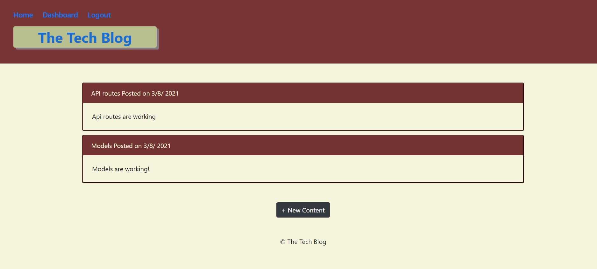
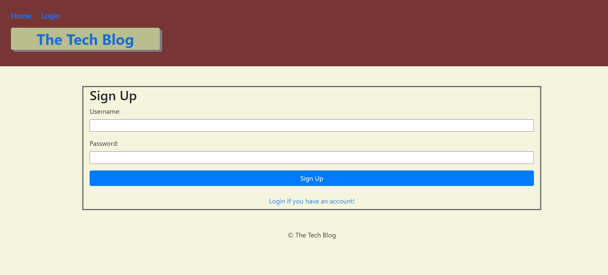

# TechBlog-MVC

## Contents

1. [Technologies-Used](#Technologies-Used)
2. [Description](#Description)
3. [Deploy](#Link)
4. [Usage](#Usage)
5. [License](#License)
6. [Credits](#Credits)
7. [Contributing](#Contributing)
8. [Questions](#Questions)

## Technologies-Used

1. Javascript
2. Node.js
3. Node packages
   - MySQL
   - connect-session-sequelize
   - express-session
   - handlebars
   - dotenv
   - bcrypt
   - express
   - mysql2
   - sequelize
4. MySQL Database
5. Heroku / JawsDB (Database)

## Description

- An Application that you have to create an account, and after sign in to the app it will let you create, update, delete a blog contents.

## Deployed application link

- [Deployed Link](https://pure-reaches-15227.herokuapp.com/)

## Usage

- When user go to the webpage with deployed application, posts will be on the main page

- If user clicks on the link of the post, it will take it to login / signup page

- User needs to create an account to see full application.

- After creating an account user will be directed to dashboard, and there will be a button that takes user to new post page.

- If user go to the homepage and click on post, it will take user to specific post page

- If user click on the post in the specific post page, it will let the user create a comment on specific post. (Accordion style button added).

- If user click on the specific post on dashboard page, it will let the user update or delete their posts.

## License

- 

## Credits

- Created by Tolga Secme.

## Contributing

- No contributes.

##  Questions

- E-mail me for any questions [tolgasecme@icloud.com](mailto:tolgasecme@icloud.com)
- Also you can find me on Github [TolgaS92](https://github.com/TolgaS92).
